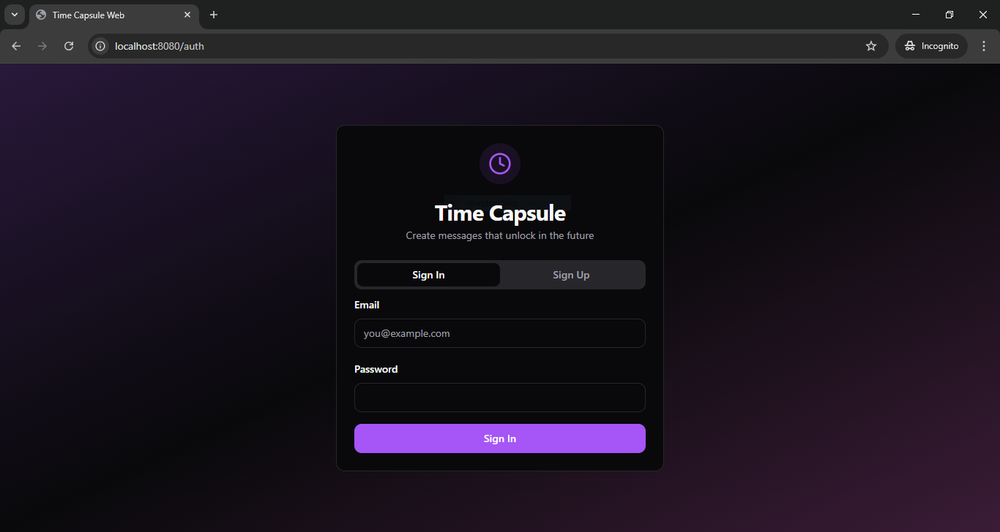
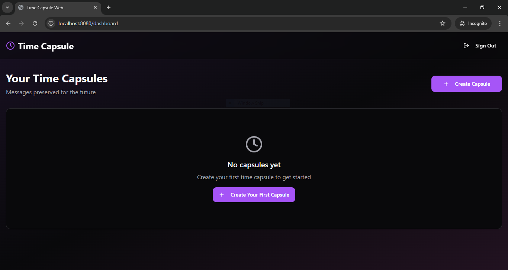
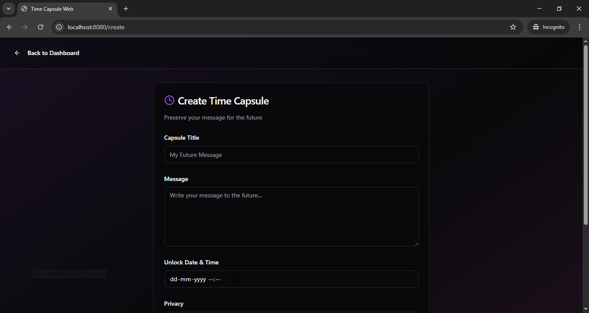

# Time Capsule

**Time Capsule** is an interactive mentorship and collaboration web application designed to connect learners with experienced professionals in technology. It provides users with features like mentorship discovery, profile creation, chat, and a responsive dashboard interface.

---

## Project Overview

This project was built using **React**, **TypeScript**, and **Vite** with a clean and modern UI.  
It focuses on creating an intuitive user experience for coding mentorship, technology discussions, and personal development tracking.

---

## Tech Stack

- **Frontend:** React, TypeScript, Tailwind CSS, Vite  
- **UI Components:** ShadCN/UI  
- **Deployment:** Hostinger / GitHub Pages  
- **Version Control:** Git and GitHub  

---

## Features

- User Authentication (Login / Signup)  
- Profile Creation and Management  
- Mentor Listing with Filters  
- Secure and Responsive Dashboard  
- AI-assisted Mentor Recommendations (optional module)

---

## Future Enhancements

- Integration with a chat system for mentor-student communication  
- AI-powered skill assessment tool  
- Project collaboration boards  

---

## Screenshots

---

## Author

**Mukul Saini**  
BCA Data Science Student  
EA2431201010229  

---

## License

This project is licensed under the [MIT License](./LICENSE) © 2025 Mukul Saini.  
All code in this repository is written, customized, and maintained by Mukul Saini for educational and portfolio purposes.
